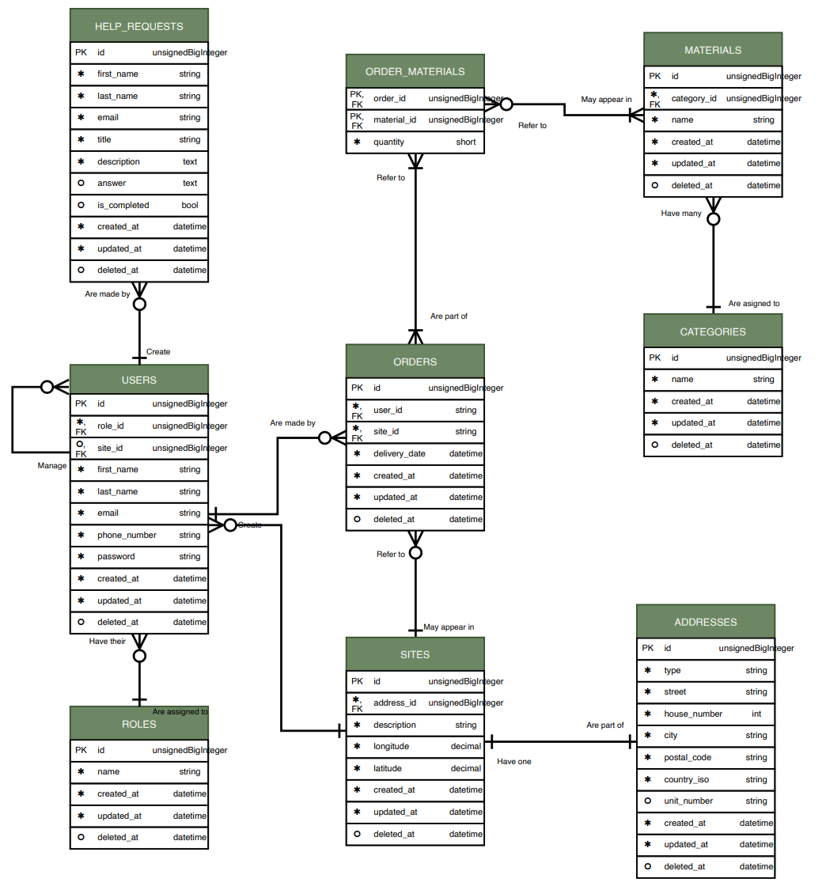

# Aquafin bestelapp
Webapplicatie voor het beheer van materiaalbestellingen binnen het Aquafin netwerk. Deze applicatie laat techniekers toe om bestellingen te plaatsen voor hun werksite, terwijl managers bestellingen kunnen raadplegen voor logistieke doelen.

Admins hebben volledige controle over wat (materialen, rollen, categorieën, ...) beschikbaar is op de website voor de verschillende werknemers binnen Aquafin.

Dit webapplicatie werd gemaakt in opdracht van Aquafin voor een examenproject bij de Erasmushogeschool Brussel voor de opleiding "Graduaat in het Programmeren" in het eerste jaar.

---
## Functionaliteiten
### Techniekers

- Bestellingen plaatsen met materialen, hoeveelheden, leverdatum en leverplaats.
- Eigen bestellingen bekijken en annuleren.

### Managers

- Volledig overzicht en beheer van alle bestellingen
- Detailweergave per bestelling met materialen, hoeveelheden, leverdatum, datum van bestelling, leverplaats


### Admins

- Volledige controle over beschikbaarheid van alle verschillende componenten (bijvoorbeeld materialen of categorieën)
- Hulpverzoeken bij het login beantwoorden

### Algemeen

- Publiek hulpverzoekformulier
- Beveiligd met rolgebaseerde toegangscontrole

---

## Documentatie

De technische documentatie van de broncode wordt gegenereerd via [phpDocumentor](https://www.phpdoc.org/).

### Documentatie genereren

```bash
composer require --dev phpdocumentor/shim ## Een keer uitvoeren
php vendor/bin/phpdoc -d app -t docs     
```


De documentatie bevindt zich dan in `docs/index.html`, die je in jouw browser kan openen.

---

## Installatie

### Vereisten

- PHP >= 8.3
- Composer
- Node.js >= 18 & npm
- MySQL

### Stappen

1. Repository klonen
```bash

mkdir <naam-project>
cd <naam-project>
git clone https://github.com/LilianLevano/aquafin-bestelapp
 
```

2. Dependencies installeren

```bash
composer install
npm install
```

3. Omgevingsvariabelen instellen

```bash
cp .env.example .env
php artisan key:generate
```
! .env aanpassen met eigen databasegegevens
```env
DB_CONNECTION=mysql
DB_HOST=127.0.0.1
DB_PORT=3306
DB_DATABASE= <naam-database>
DB_USERNAME= <username>
DB_PASSWORD= <wachtwoord-username>
```
> **SSH-tunnel** — als de database op een externe server staat, open je eerst een tunnel:
> ```bash
> ssh -L 3306:localhost:3306 gebruiker@server
> ```
> Gebruik dan `DB_PORT=3306` in `.env`.

> Als de "3306" poort niet werk, probeer eender welk andere poort (3307, 3308).
>
> Bij een verandering van een poort, moeten beiden .env file (DB_PORT=xxxx) en SSH-tunnel commando aangepast worden.


### 4. Database migreren en seeden

```bash
php artisan migrate
php artisan db:seed
```

### 5. Assets builden

```bash
npm run build
# of voor ontwikkeling:
npm run dev
```

### 6. Server starten

```bash
php artisan serve
```
---
## Rollen & toegang

De applicatie gebruikt een rolgebaseerd toegangssysteem via `RoleMiddleware`. Elke gebruiker heeft één rol.

| Rol             | Toegang                                                          |
|-----------------|------------------------------------------------------------------|
| **Admin**       | Accounts, rollen, materialen, categorieën, hulpverzoeken beheren |
| **Technieker**  | Bestellingen plaatsen en annuleren, materialen bekijken          |
| **Manager**     | Overzicht, detail en beheren van alle bestellingen               |
 
---
---
## Testaccounts

Een account per rol worden automatisch aangemaakt bij het seeden (database aanvullen) om makkelijk toegang te krijgen binnen de webapplicatie.

Maak zelf een aparte admin account, via de admin testaccount, dan kunnen de testaccounts veilig verwijderd worden.

| Rol         | E-mail                     | Wachtwoord |
|-------------|----------------------------|------------|
| Admin       | `admin@aquawerf.com`       | `password` |
| Technieker  | `technieker@aquawerf.com`  | `password` |
| Manager     | `manager@aquawerf.com`     | `password` |

---
## Auteurs

| Naam                 | GitHub                                 |
|----------------------|----------------------------------------|
| Hamzic Bruno         | https://github.com/CodeSmashing        |
| Duga Kanjinga Meryem | https://github.com/meryemduga          |
| Mohsine Rania        | https://github.com/raniamohsine        |
| Aouragh Nisrine      | https://github.com/nisrineaourag1-star |
| Levano Lilian        | https://github.com/LilianLevano        |

--- 
## ERD Diagram



